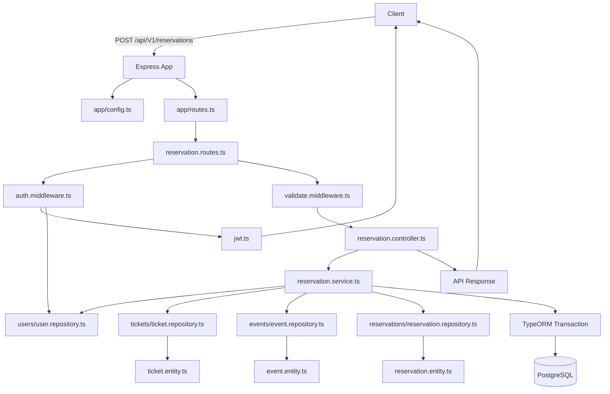
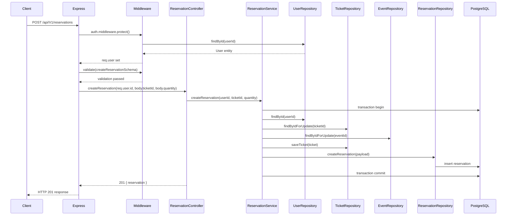

# Execution Flow

## 1. System Entry Points

- `src/server.ts` — main entry point; starts Express server and initializes database/Redis.
- `src/app/index.ts` — registers middleware, global process handlers, and routes.
- `src/app/routes.ts` — exposes HTTP triggers for:
  - `GET /` health check
  - `GET /docs` Swagger UI
  - `POST /api/V1/users/signup`
  - `POST /api/V1/users/login`
  - `POST /api/V1/users/logout`
  - `POST /api/V1/users/refresh-token`
  - `POST /api/V1/users/forgot-password`
  - `PATCH /api/V1/users/reset-password`
  - `GET /api/V1/users/me`
  - `POST /api/V1/events`
  - `GET /api/V1/events`
  - `POST /api/V1/reservations`
  - `POST /api/V1/payments`
  - `GET /api/V1/payments/verify`
- Docker trigger: `docker-compose.yml` loads `app`, `postgres`, and `redis` services.
- External webhook trigger: `GET /api/V1/payments/verify` from Zarinpal.

## 2. Primary Use Case Flow: Create Reservation

This flow is the most complex path because it involves auth, validation, transactional database updates, and inventory logic.

### Step-by-step trace

1. **Client request**
   - Endpoint: `POST /api/V1/reservations`
   - Route defined in `src/core/reservations/reservation.routes.ts`.

2. **Express entry**
   - Flow enters `src/app/index.ts`: `config(app)` and `routes(app)`.
   - `routes(app)` mounts `reservationRouter` from `src/core/reservations/reservation.routes.ts`.

3. **Middleware executed**
   - `router.use(protect)` in `src/core/reservations/reservation.routes.ts` applies `protect()` to all reservation routes.
   - `protect` in `src/middlewares/auth.middleware.ts` verifies JWT from `Authorization` header or `req.cookies.jwt`.
   - If token is missing or invalid, `protect()` throws `NotAuthorizedError`.
   - If valid, `req.user` is resolved by `userRepository.findById()` in `src/core/users/user.repository.ts`.

4. **Input validation**
   - `validate(createReservationSchema)` in `src/core/reservations/reservation.routes.ts` validates the full request shape.
   - Schema is defined in `src/schemas/reservations-schema/createReservation.schema.ts`.
   - Validation confirms:
     - `req.body.ticketId: string`
     - `req.body.quantity: number` (positive integer)

5. **Controller handler**
   - `ReservationController.createReservation()` in `src/core/reservations/controllers/reservation.controller.ts`.
   - Passes `req.user.id`, `req.body.ticketId`, and `req.body.quantity` to `ReservationService.createReservation()`.

6. **Business logic**
   - `ReservationService.createReservation()` in `src/core/reservations/services/reservation.service.ts`.
   - Begins a database transaction using `this.dataSource.transaction()`.
   - Validates user exists via `UserRepository.findById()`.
   - Locks the ticket row using `TicketRepository.findByIdForUpdate()`.
   - Loads event data using `EventRepository.findByIdForUpdate()`.
   - Verifies event status and time windows.
   - Checks ticket sale window and quantity constraints.
   - Calculates available capacity and checks for duplicates with `ReservationRepository.findPendingReservation()`.
   - Updates ticket reserved count and saves with `TicketRepository.saveTicket()`.
   - Creates a pending reservation via `ReservationRepository.createReservation()` with status `PENDING` and expiration time.

7. **Repository / database layer**
   - `ReservationRepository.createReservation()` in `src/core/reservations/reservation.repository.ts` creates entity and saves it.
   - `TicketRepository.saveTicket()` persists ticket reserved count changes.
   - `EventRepository.saveEvent()` may update event status if needed.
   - The entire set of operations is wrapped in a TypeORM transaction to ensure atomicity.

8. **Response formatting**
   - After transaction commits successfully, `ReservationController.createReservation()` returns status `201` with JSON:
     ```json
     {
       "status": "success",
       "data": {
         "reservation": { ... }
       }
     }
     ```

## 3. Data Pipeline

### Raw JSON Input

- Client posts `ticketId` and `quantity` to `/api/V1/reservations`.
- Auth token may arrive via `Authorization` or `jwt` cookie.

### Validation / DTO layer

- `src/schemas/reservations-schema/createReservation.schema.ts` validates request structure.
- The request body becomes a typed object via `req.body` cast after validation.

### Controller / handler

- `src/core/reservations/controllers/reservation.controller.ts` reads `req.body.ticketId` and `req.body.quantity`.
- User identity is read from `req.user.id` set by `protect()`.

### Service / business model

- `src/core/reservations/services/reservation.service.ts` transforms input into domain operations:
  - `userId`, `ticketId`, and `quantity`
  - reservation status transitions
  - event state validation
  - capacity decrement and lock semantics

### Repository / entity mapping

- `ReservationRepository.createReservation()` converts a partial reservation payload into a `Reservation` entity and persists it.
- `TicketRepository.findByIdForUpdate()` returns a `Ticket` entity with a pessimistic lock.
- `EventRepository.findByIdForUpdate()` returns an `Event` entity.

### API Response serializer

- The controller returns the saved reservation object directly inside JSON.
- There is no separate response DTO serializer; the entity object is transmitted in API response.

## 4. Error Flow

### Validation failure

- If request data fails Zod validation in `src/middlewares/validate.middleware.ts`, response is returned immediately with `400` and body:
  ```json
  {
    "status": "fail",
    "errors": [{ "field": "body.quantity", "message": "..." }]
  }
  ```
- This bypasses controller and service execution.

### Authentication failure

- In `src/middlewares/auth.middleware.ts`, missing or invalid token throws `NotAuthorizedError`.
- That error reaches `src/app/routes.ts` where `errorHandler` is attached.

### Business logic and DB errors

- In service methods like `ReservationService.createReservation()`:
  - Missing entity => `NotFoundError`
  - Invalid state => `BadRequestError` or `DuplicateError`
- These errors bubble to the global error handler.

### External API failure

- In `src/core/integrations/zarinpal/services/zarinpal.service.ts`, HTTP failures or `response.data.errors` throw `BadRequestError`.
- The payment service catches none explicitly, so it bubbles to `errorHandler`.

### Global error handler

- `src/middlewares/error-handler.ts` receives errors from Express.
- If the error is an `AppError` subclass, it returns `err.statusCode` and `err.serializeErrors()`.
- For unknown errors, it logs to console and returns `500` with generic message:
  ```json
  {
    "status": "error",
    "errors": [{ "field": null, "message": "Something went wrong." }]
  }
  ```

### Process-level shutdown

- `src/server.ts` handles `unhandledRejection` and exits process after closing server.
- `src/app/index.ts` handles `uncaughtException` and `SIGINT`, closing Redis gracefully.

## 5. Visual Diagrams

### Mermaid Flowchart



### Mermaid Sequence Diagram



### Alternate major flow summary

- **User signup/login**: `src/core/users/user.routes.ts` -> `AuthController.signup/login` -> `AuthService.signup/login` -> `UserRepository.createUser/findByEmail` -> `createSendTokenAndResponse()`.
- **Payment creation**: `payment.routes.ts` -> `PaymentController.createPayment` -> `PaymentService.createPayment` -> `ZarinpalService.requestPayment` -> external Zarinpal API.
- **Payment verification webhook**: `payment.routes.ts` -> `PaymentController.verifyPayment` -> `PaymentService.verifyPayment` -> `ZarinpalService.verifyPayment`.

---

This document maps the code-level execution path from endpoint to database, including how data is validated, transformed, persisted, and returned.